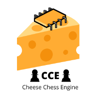

<center></center>

# CCE - Cheese Chess Engine
Like chess but cheesy? A hobbiest chess engine/game (with high ambitions).

## Algorithms
CCE currently has 3 algorithms. You can change the algorithm used by editing ```build.sh```. The ELO rating for the algorithms is represented below. (data from various games against Stockfish and human players) 
| Algorithm   | Approx. ELO Rating |
|-------------|--------------------|
| segfaultdev | 1400               |
| aa2006      | 1250               |
| values      | 1000               |

## Building
Building from source is really easy. Go into a suitable directory and clone this repo:
```bash
git clone https://github.com/cheese-chess/cheese_chess.git
```
Then, execute ```build.sh```:
```bash
chmod +x build.sh
./build.sh
```
After that, you should see a ```cheese``` executable. Run it to open the game:
```
./cheese <depth>
```
where depth is the number of layers the algorithm should search. Recommended: 4.<br>

## Changing the Algorithm
To change the algorithm, open ```build.sh``` and put the name of your algorithm. For example, if the algorithm is ```CHEESE_ALGO_SEGFAULTDEV``` and you want to try the aa2006 algorithm, you would change it to ```CHEESE_ALGO_AA2006```. After that, build again, and execute.
